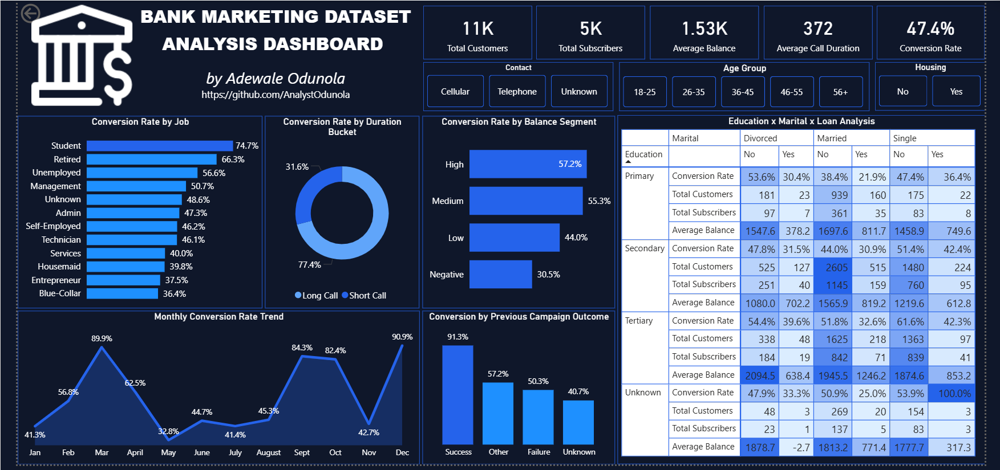

# Bank Marketing Analysis

## Overview

This project analyzes a bank marketing campaign dataset to identify the factors influencing customer deposit subscriptions.

The dashboard explores customer demographics, financial characteristics, campaign performance, and behavioral patterns to uncover the key drivers of conversion and support data-driven marketing decisions.

---

## Business Problem

The bank aims to improve the effectiveness of its marketing campaigns by identifying:

- High-converting customer segments
- Factors influencing subscription decisions
- The impact of previous campaign outcomes
- The relationship between customer engagement and conversion

The goal is to increase conversion rates while optimizing marketing resources.

---

## Dataset Information

The dataset contains:

- Customer Demographics
  - Age
  - Job
  - Education
  - Marital Status

- Financial Information
  - Account Balance
  - Housing Loan Status

- Campaign Information
  - Contact Method
  - Call Duration
  - Previous Campaign Outcome

- Deposit Subscription Status

---

## Skills Demonstrated

- Power BI
- Power Query
- DAX
- Data Cleaning
- Data Transformation
- Data Modeling
- KPI Development
- Customer Segmentation
- Business Intelligence
- Data Visualization
- Dashboard Design
- Business Storytelling

---

## Key Insights

- Previous campaign success was the strongest predictor of future conversion.
- Students and Retired customers were the highest-converting segments.
- Longer customer conversations generated significantly better outcomes.
- Customers with higher account balances showed stronger subscription behavior.
- Campaign performance varied across different months.

---

## Recommendations

- Prioritize high-converting customer segments.
- Retarget customers with previous successful campaign outcomes.
- Improve customer engagement through longer, higher-quality conversations.
- Focus campaigns during high-performing periods.
- Use customer balance and historical behavior for lead scoring.

---

## Dashboard Preview

---

## Author

**Adewale Odunola**
