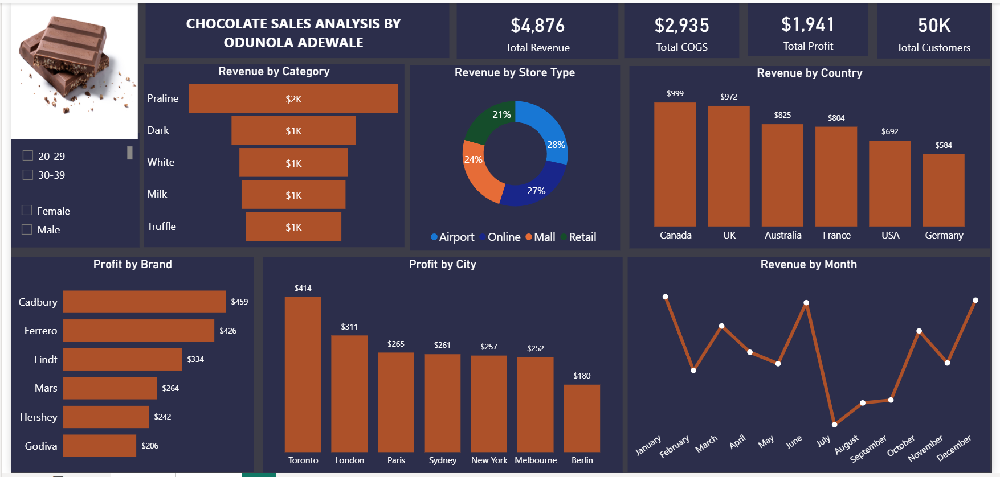

# Chocolate Sales Analysis Dashboard

## Project Overview
This Power BI dashboard analyzes chocolate sales performance across different countries, brands, store types, and customer segments.

The project focuses on uncovering revenue trends, profit performance, customer insights, and monthly sales behavior to support business decision-making.

## Tools Used
- Power BI
- Power Query
- DAX
- Excel

## Key Insights
- Canada generated the highest revenue.
- Cadbury recorded the highest profit among brands.
- Airport stores contributed the highest share of revenue.
- Monthly revenue trends revealed seasonal fluctuations.

## Dashboard Features
- Revenue analysis by category
- Revenue by country
- Profit by brand
- Profit by city
- Revenue trend by month
- Customer demographic filtering

## Data Preparation
Data cleaning and transformation were performed using Power Query before visualization in Power BI.

## Dashboard Preview

## Author
Odunola Adewale

