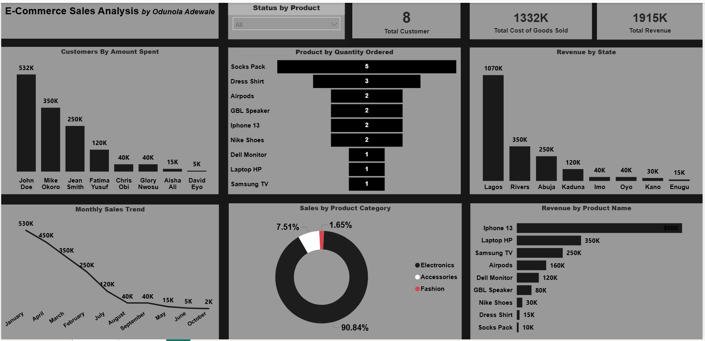

> 🎉 My first Power BI project and the starting point of my data analytics dashboard portfolio.

# 🛒 E-Commerce Sales Analysis

## Project Overview

This project analyzes sales performance, customer spending patterns, product demand, and revenue distribution across multiple states and product categories.

Notably, this was my **first-ever Power BI project**, marking the beginning of my data analytics journey. It provided hands-on experience in data modeling, dashboard design, DAX calculations, and creating interactive business reports.

## Business Problem

E-commerce businesses need visibility into customer purchasing behavior, product performance, and revenue trends to make informed business decisions.

This dashboard was built to answer key questions:

- Which products generate the most revenue?
- Which customers contribute the highest sales?
- Which states drive the most revenue?
- What are the monthly sales trends?
- Which product categories perform best?

## KPIs

- Total Revenue: ₦1.92M
- Total Cost of Goods Sold: ₦1.33M
- Total Customers: 8
- Product Quantity Ordered
- Revenue by Product
- Revenue by State
- Monthly Sales Trend

## Key Insights

- iPhone 13 generated the highest revenue at ₦900K.
- Lagos contributed the largest share of revenue with ₦1.07M.
- John Doe was the highest-spending customer at ₦532K.
- Electronics dominated sales, contributing over 90% of total revenue.
- Revenue declined significantly throughout the year, indicating potential seasonality or reduced customer demand.

## Recommendations

- Increase inventory and promotions for high-performing products such as iPhone 13 and Laptop HP.
- Focus marketing efforts in high-revenue locations like Lagos and Rivers.
- Improve sales performance in low-performing states through targeted campaigns.
- Investigate causes of declining monthly sales and implement customer retention strategies.
- Diversify product offerings to reduce dependence on Electronics.

## Skills Demonstrated

- Data Cleaning
- Power Query
- Data Modeling
- DAX Measures
- KPI Development
- Interactive Dashboard Design
- Data Visualization
- Business Insights & Storytelling

## Tools Used

- Power BI
- Power Query
- DAX
- Microsoft Excel

## Dashboard

## Author

**Odunola Adewale**
