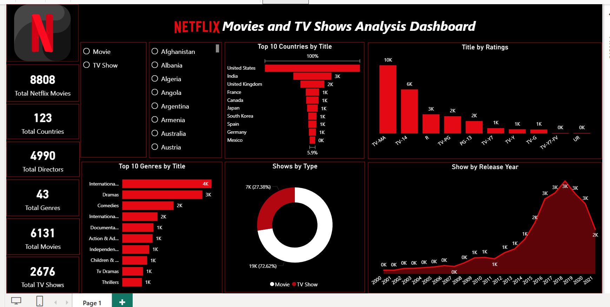

# 🎬 Netflix Movies and TV Shows Analysis Dashboard

## Overview

This Power BI dashboard analyzes Netflix's movie and TV show catalog across countries, genres, ratings, release years, and content types. The dashboard provides insights into Netflix's content distribution, audience ratings, geographic reach, and catalog growth over time.

## Business Problem

Streaming platforms manage thousands of titles across multiple countries, genres, and audience ratings. Understanding content distribution and growth trends is essential for identifying audience preferences and supporting content strategy decisions.

The goal of this project was to build an interactive dashboard that answers key questions:

- Which countries contribute the most Netflix titles?
- What are the most popular genres?
- How are titles distributed across ratings?
- What proportion of Netflix content consists of Movies versus TV Shows?
- How has Netflix's content library grown over time?

## Key KPIs

- **Total Netflix Titles:** 8,808
- **Total Movies:** 6,131
- **Total TV Shows:** 2,676
- **Total Directors:** 4,990
- **Total Countries:** 123
- **Total Genres:** 43

## Dashboard Features

- Movie vs TV Show Filtering
- Country Analysis
- Genre Analysis
- Rating Distribution Analysis
- Release Year Trend Analysis
- Content Type Breakdown
- Interactive Slicers
- Drill-Down Functionality

## Skills Demonstrated

- Data Cleaning & Transformation using Power Query
- Handling Missing Values
- Data Modeling
- DAX Measures & Calculations
- KPI Development
- Interactive Dashboard Design
- Data Visualization & Storytelling

## Tools Used

- Power BI
- Power Query
- DAX
- Excel

## Dashboard

The dashboard provides a comprehensive view of Netflix's content library, enabling users to explore content distribution by country, genre, rating, release year, and content type through interactive visualizations and filtering capabilities.

## Dashboard Preview

## Author

**Odunola Adewale**
