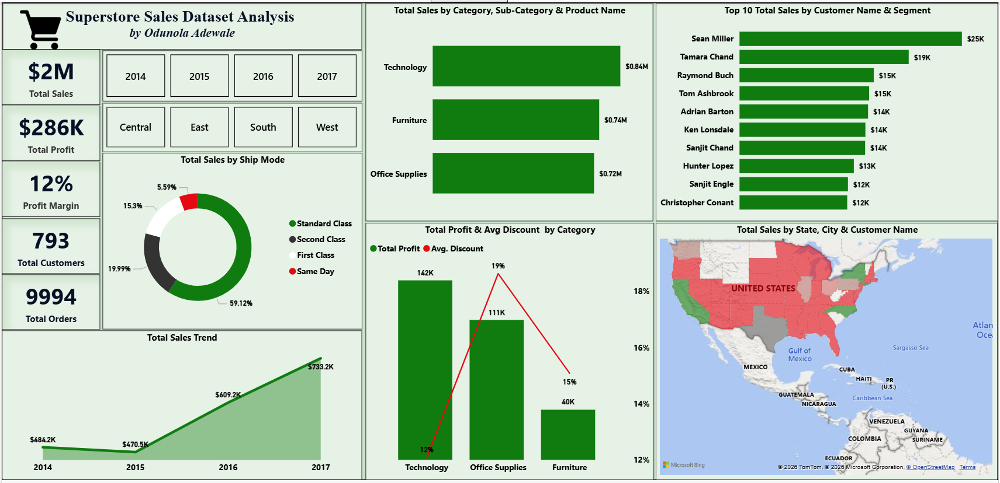

# 🛒 Superstore Sales Dataset Analysis

## Dashboard Preview

## Overview

This Power BI dashboard analyzes Superstore sales performance from 2014–2017 across products, customers, regions, shipping modes, and categories. The dashboard was designed to provide a clear view of sales performance, profitability, customer behavior, and geographic trends through interactive visualizations and drill-down functionality.

## Business Problem

Retail businesses generate large volumes of transactional data, making it challenging to quickly identify profitable products, top-performing customers, regional sales trends, and the impact of discounts on profitability.

The objective of this project was to build an interactive dashboard that helps answer key business questions:

- Which product categories generate the highest sales?
- Which customers contribute the most revenue?
- How do discounts impact profit?
- Which regions and states drive business performance?
- How has sales performance changed over time?

## Key KPIs

- **Total Sales:** $2M
- **Total Profit:** $286K
- **Profit Margin:** 12%
- **Total Customers:** 793
- **Total Orders:** 9,994

## Dashboard Features

- Interactive Year and Region Slicers
- Sales Trend Analysis
- Customer Performance Analysis
- Category & Product Analysis
- Geographic Sales Distribution
- Ship Mode Analysis
- Profit vs Discount Analysis
- Drill-Down Functionality

## Skills Demonstrated

- Data Cleaning and Transformation using Power Query
- Data Modeling
- DAX Measures and Calculations
- KPI Development
- Interactive Dashboard Design
- Drill-Down and Cross-Filtering
- Data Visualization Best Practices
- Business Insight Generation

## Tools Used

- Power BI
- Power Query
- DAX
- GitHub

## Dashboard

The dashboard provides a comprehensive view of Superstore sales performance, enabling stakeholders to monitor revenue, profitability, customer behavior, regional performance, and operational efficiency through interactive filtering and drill-down capabilities.

## Author

**Odunola Adewale**
